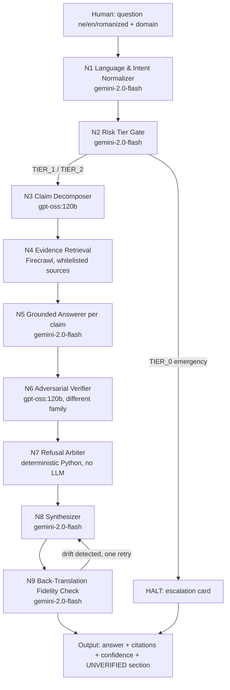

# VERITAS
### Refusal-Aware Grounded Answering for Low-Resource Languages

> When you ask an LLM a high-stakes health or legal question in Nepali, it doesn't say "I don't know" — it invents a dosage. VERITAS is a nine-node workflow that decomposes the question into atomic claims, grounds each one in authoritative sources, has a second model actively try to falsify it, and **refuses to answer** when the evidence isn't there.

Built for Reverie Hacks 2026 — ML Prompt Engineering track.

---

## The comparison

| Failure mode | Single prompt | VERITAS |
|---|---|---|
| Nepali drug dosage question | Confidently states a number, no source, often wrong | Cites DDA/WHO or refuses |
| "What does Article X of the Labour Act say?" | Invents a plausible article number and content | Retrieves actual text or refuses |
| Romanized Nepali ("bukhar ko lagi k khane") | Misparses, answers a different question | Normalises to Devanagari, confirms intent |
| Medical emergency phrased casually | Gives home-remedy advice | Detects TIER-0, escalates, stops |
| Question with no good answer | Answers anyway | Explicit "unverified" section |

## Architecture



Three design decisions that make this a *workflow* and not a chain:

1. **Cross-model verification (N6)** — the verifier (`gpt-oss:120b` via Ollama Cloud) is a different model family from the answerer (`gemini-2.0-flash`). A model asked to check its own work agrees with itself; a single prompt structurally cannot do this.
2. **Deterministic refusal arbitration (N7)** — the decision to refuse is made by Python, not an LLM. Refusal behaviour is auditable, testable, and identical every run.
3. **Atomic claim decomposition (N3)** — a compound question is split into independently-verifiable sub-claims, so partial knowledge produces a partial, honest answer instead of a single confident wrong one.

Full node-by-node reasoning: [docs/node_reference.md](docs/node_reference.md) · Design decisions: [docs/design_decisions.md](docs/design_decisions.md) · Comparison samples: [docs/samples.md](docs/samples.md) · Workflow diagram: [docs/workflow.png](docs/workflow.png)

## Quickstart

```bash
python -m venv .venv
.venv/Scripts/activate        # Windows
pip install -r requirements.txt
cp .env.example .env          # fill in GEMINI_API_KEY, OLLAMA_API_KEY, FIRECRAWL_API_KEY

python -m veritas.cli "बच्चालाई ज्वरो आयो, प्यारासिटामोल कति दिने?"

uvicorn server:app --reload   # live split-screen UI at http://localhost:8000
```

## Benchmark

30 questions across seven buckets (answerable health facts, unanswerable health claims, legal lookups, romanized Nepali, numeric dosing, TIER-0 emergencies, false-premise traps). Both arms run and scored on six metrics: hallucination rate, citation validity, appropriate refusal rate, over-refusal rate, TIER-0 escalation recall, and cost/latency per query.

```bash
python benchmark/run_baseline.py
python benchmark/run_veritas.py
python benchmark/score.py
python docs/build_samples.py    # fills the comparison deep-dives into docs/samples.md
```

Every LLM call is cached to disk, so reruns after an interrupted benchmark are cheap and resumable — both runner scripts skip questions already answered.

## Project structure

```text
veritas/            orchestrator, clients.py (cached multi-provider LLM calls), nodes/ (N1–N9), whitelist.py
web/                 the live split-screen UI ("The Tribunal") — vanilla JS, no build step
server.py            FastAPI app serving the UI and streaming both arms over SSE
corpus/              offline evidence fallback, used if Firecrawl is unavailable
benchmark/           30 questions, both-arm runners, scorer, scorecard
docs/                workflow diagram + generator, node reference, design decisions, samples
tests/               unit tests for the deterministic refusal arbiter (N7)
```

## Status

All nine nodes, the orchestrator, the web UI, the benchmark harness, and all three graded deliverables (workflow PNG, node documentation, comparison samples) are built and tested against mocked pipeline runs. A live run with real `GEMINI_API_KEY` / `OLLAMA_API_KEY` / `FIRECRAWL_API_KEY` values in `.env` is the one remaining step to populate `benchmark/scorecard.md` and the deep-dive samples with real numbers. Build phases are tracked in commit history.
